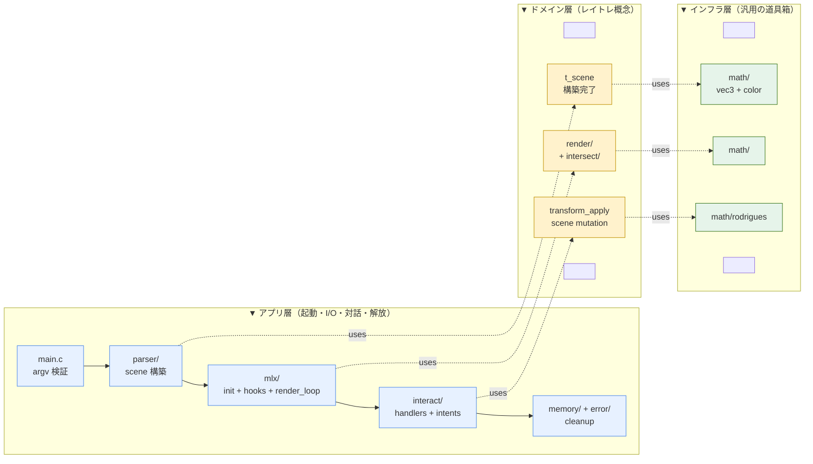

> **この章のゴール**: miniRT が「何を作り、どの層がどの順で動くか」を 30 分で掴む。データ構造や数式の詳細は次章以降に分担。

## 0. 概要

`./miniRT scene.rt` でシーンを描画し、ウィンドウ表示後にキーボード+マウスでカメラ・ライト・オブジェクトを runtime で動かせるレイトレーサーを C + MiniLibX で実装する。

設計判断の根拠は `../adr/` に分離。要件は `../002-requirements-spec.md` を参照。

## 1. スコープ

| 含む | 含まない |
|---|---|
| mandatory 全機能（plane / sphere / cylinder + キャップ、ambient + diffuse + hard shadow、translation / rotation） | bonus 全項目（specular, checkerboard, multi-light, 追加二次曲面, bump map） |
| Runtime 対話操作（keyboard 選択 + transform、mouse 選択 + camera-look） | アンチエイリアシング、反射、屈折、テクスチャ画像、マルチスレッド |
| .rt パーサー（公式フォーマット準拠 + transform 拡張なし） | .rt フォーマット拡張（T/R フィールドは入れない、ADR-0004 参照） |
| エラー出力・cleanup・leak 0 | ウィンドウリサイズ対応 |

## 2. 工数見積

| Phase | 内容 | 時間 |
|---|---|---|
| 1-12 | 要件定義書 002 の Phase 1-12 | 118h |
| G | interact/ 実装（keyboard） | +8〜12h |
| G+ | interact/ 実装（mouse click + camera drag-look、ADR-0006） | +3〜5h |
| **合計** | | **129〜135h** |

期間 2026-05-17 〜 2026-05-31 の 2 週間に対し、ギリギリ収まる見込み。

## 3. 全体像 — 3層 × 処理フロー

縦軸 = アーキテクチャの層、横軸 = 処理の時系列。「いつ・どの層が・何をしているか」を 1 枚で追える。



> **【用語】3層アーキテクチャ**
> 「依存が一方向に流れる」設計の作法。下の層は上の層を知らない。
> miniRT では: アプリ層（外界とつながる、副作用あり）→ ドメイン層（レイトレ概念、純粋）→ インフラ層（汎用の道具、何にも依存しない）。
>
> **【なぜこの分け方】**
> ① テストしやすい（ドメイン層はファイルもウィンドウも知らない、`t_scene` を渡すだけで動く）、
> ② defense で説明しやすい（「render は scene と ray さえあれば動く」と一言で済む）、
> ③ bonus 拡張時の影響範囲が読める（specular は `render/shade.c` 1 ファイルだけ）。

> **【用語】DDD と DOD の住み分け**
> miniRT では戦略的 DDD（層分離・Bounded Context）は採用するが、戦術的 DDD（Aggregate, Entity）は採用しない。
> 代わりにホットループはデータ指向設計（DOD = 型別ループ、分岐予測の最適化）。保持は型別 linked list で実装簡素化を取る（ADR-0005）。
> 詳細は `../study/007-architecture-ecs-dod-vs-ddd.md`。

## 4. 起動シーケンス

```
1. main: argv 検証
2. parser: .rt → t_scene を構築（1 パスで読み、型別 intrusive list に append）
3. mlx_init / window / image
4. build_camera_basis: forward から right / up を計算
5. render(): 全ピクセル走査 → image 書き込み → put_image_to_window
6. mlx_hook 登録: key, mouse press/release/motion, destroy
7. mlx_loop: イベント待ち
   - key 押下          → interact/ で selection or transform_apply → render() 再描画
   - マウス左 click     → interact/ で object 選択 → re-render
   - マウス左 drag      → CAMERA 選択中なら yaw/pitch を蓄積、release で render
   - ESC / 閉じるボタン → cleanup → exit(0)
```

## 5. 対話ループ（runtime、ADR-0007 の intent 層を経由）

```
[ event ]
   ↓
[handler 層]   key_bindings.c / mouse_bindings.c
   ↓          （keycode / mouse event を該当 intent に dispatch）
[intent 層]   intent_translate / intent_rotate / intent_select_* /
              intent_request_render / intent_quit
   ↓          （a->input.selected を見て scene を mutate、dirty を立てる）
[apply 層]    apply_translate / apply_rotate / selection.c
   ↓
[render]      a->input.dirty == 1 のとき render()
```

| 入力 | dispatch される intent |
|---|---|
| TAB | `intent_select_next` |
| W/S/A/D/Q/E | `intent_translate(δ)`（δ は camera 基底 or world-up に沿う） |
| ← / → / ↑ / ↓ | `intent_rotate(axis, ±ANGLE_STEP)` |
| SPACE | `intent_request_render` |
| ESC / ✕ | `intent_quit` |
| マウス左 click | `intent_select_object(obj_type, obj_ptr)`（ピクセル → primary ray → `find_closest_hit`） |
| マウス左 drag (CAMERA 選択中) | `intent_rotate(yaw, dx*感度)` + `intent_rotate(pitch, dy*感度)`、release で `intent_request_render` |

詳細は `400-interaction-and-errors.md`。

## 関連

- 旧版（参考）: `../003-architecture-design.md`
- 次章: `200-data-and-modules.md` — データ構造とモジュール構成
- 要件: `../002-requirements-spec.md`
- 入力仕様の根拠: `../adr/0004-transform-ux-interactive.md`, `../adr/0006-mouse-input-selection-and-camera-look.md`
